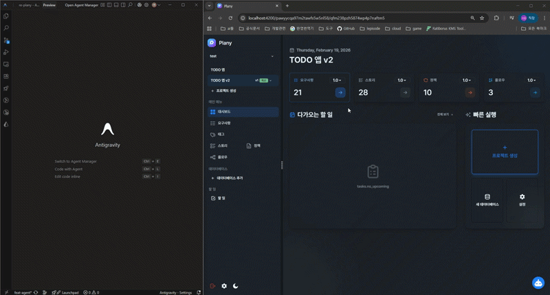

# ng-locator

브라우저에서 `Alt + 클릭`으로 Angular 컴포넌트의 **템플릿 태그 라인**을 에디터에서 바로 여는 개발 도구입니다.



## 주요 기능

- **Alt + 클릭** → 클릭한 태그가 위치한 **템플릿 파일의 정확한 라인**으로 에디터 이동
- **Alt 키** → 컴포넌트들이 파란색 테두리로 하이라이트
- **마우스 호버** → 컴포넌트 정보 툴팁 표시
- **Watch 모드** → 파일 변경 시 자동 재스캔 (별도 스캔 명령 불필요)

---

## 설치

```bash
npm install github:asdfgl98/ng-locatorjs
```

## 빠른 시작

### 1. main.ts에 추가

```typescript
import { bootstrapApplication } from '@angular/platform-browser';
import { appConfig } from './app/app.config';
import { AppComponent } from './app/app.component';
import { installAngularLocator } from 'ng-locator';

function initLocator() {
  if ((window as any).ng?.getComponent) {
    installAngularLocator({
      editor: 'cursor',  // 'cursor' | 'code' | 'webstorm' | 'windsurf' | 'antigravity'
    });
  } else {
    setTimeout(initLocator, 100);
  }
}

if (document.readyState === 'complete') {
  initLocator();
} else {
  window.addEventListener('load', initLocator);
}

bootstrapApplication(AppComponent, appConfig).catch(console.error);
```

### 2. 서버 실행 (Watch 모드)

```bash
npx ng-locator-server --editor antigravity --watch
```

> Watch 모드는 스캔 + 서버를 통합하여 **별도의 `ng-locator-scan` 실행이 불필요**합니다.
> `.ts` / `.html` 파일 변경 시 자동으로 재스캔됩니다.

### 3. Angular 개발 서버 실행

```bash
ng serve
```

### 4. 사용

`Alt` 키를 누른 채 원하는 요소를 클릭하면 에디터에서 해당 템플릿 라인이 열립니다.

---

## CLI 옵션

### `ng-locator-server`

```bash
npx ng-locator-server [options]

Options:
  --port, -p     서버 포트 (기본값: 4123)
  --editor, -e   에디터 (cursor, code, webstorm, windsurf, antigravity)
  --watch, -w    자동 스캔 + 파일 감시 모드
  --config, -c   스캔 설정 파일 경로 (기본값: locator.config.json)
  --include, -i  추가 스캔 패턴 (여러 번 사용 가능)
  --exclude, -x  추가 제외 디렉토리 (여러 번 사용 가능)
  --map, -m      컴포넌트 맵 파일 경로
```

### `ng-locator-scan`

Watch 모드를 사용하지 않을 경우 별도로 스캔할 수 있습니다.

```bash
npx ng-locator-scan [options]

Options:
  --config, -c   설정 파일 경로 (기본값: locator.config.json)
  --output, -o   출력 파일 경로 (기본값: .locator/component-map.json)
  --watch, -w    파일 변경 감지 모드
```

---

## 커스텀 설정

### CLI에서 직접 패턴 추가

```bash
npx ng-locator-server --editor cursor --watch \
  --include "projects/**/*.component.ts" \
  --exclude "test-utils"
```

> `--include`/`--exclude`는 기본 패턴에 **추가**됩니다.

### 설정 파일 (`locator.config.json`)

기본 패턴을 완전히 교체하려면 설정 파일을 사용하세요.

```json
{
  "include": [
    "src/**/*.ts",
    "projects/**/*.ts"
  ],
  "exclude": ["node_modules", "dist", ".git"],
  "output": ".locator/component-map.json"
}
```

---

## package.json 스크립트

```json
{
  "scripts": {
    "locator": "ng-locator-server --editor cursor --watch",
  }
}
```

---

## 런타임 옵션

```typescript
interface AngularLocatorOptions {
  port?: number;              // 서버 포트 (기본값: 4123)
  editor?: 'cursor' | 'code' | 'webstorm' | 'windsurf' | 'antigravity';
  modifier?: 'alt' | 'ctrl' | 'meta' | 'shift';  // 클릭 키 (기본값: 'alt')
}
```

---

## .gitignore

```gitignore
.locator/
```

---

## 문제 해결

| 문제 | 해결 방법 |
|------|-----------|
| 컴포넌트가 열리지 않음 | `ng-locator-server` 실행 확인 (포트 4123) |
| Angular not detected | 개발 모드(`ng serve`)로 실행 중인지 확인 |
| 태그 라인이 안 맞음 | `/__locator__/reload` 엔드포인트로 재스캔 |

---

## 라이선스

MIT
